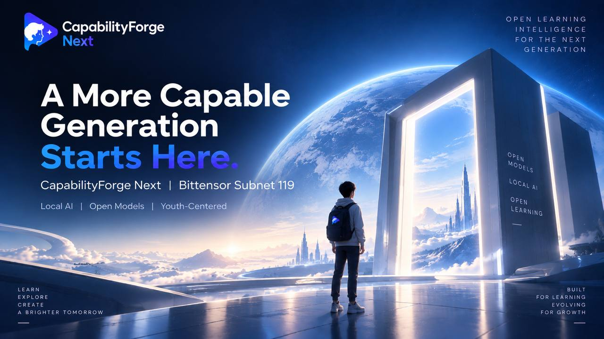

# CapabilityForge Next

> Verifiable data improvements for better learning intelligence.

**CapabilityForge Next** is Bittensor Subnet 119—an incentive network for discovering training-data improvements that make learning-oriented AI more accurate, clear, age-appropriate, and safe.

The subnet initially focuses on mathematics and the natural sciences, where answers, reasoning steps, calculations, and explanations can be evaluated objectively. Its scope can expand to additional subjects, languages, and learner profiles as reliable evaluation standards become available.

## How It Works

- **Miners** generate bounded synthetic or appropriately licensed data patches with record-level provenance.
- **Validators** check data rights, privacy, lineage, duplication, contamination, and evaluation leakage.
- Qualified patches are tested against a frozen baseline under identical training and evaluation conditions.
- Rewards reflect measurable capability improvements—not dataset size, compute expenditure, or unverified claims.

```text
GENERATE → VERIFY → TRAIN → EVALUATE → REWARD
```

## What We Measure

CapabilityForge Next evaluates whether a data patch improves:

- factual accuracy and task completion;
- reasoning quality and correct use of steps and units;
- calibration and honest handling of uncertainty;
- clear, helpful, and age-appropriate communication;
- safety without unnecessary refusal.

Youth safety and data responsibility are mandatory. Private information, real-minor personal data, hidden evaluation content, and materials without suitable usage rights are not eligible.

**Bittensor · Subnet 119**  
**Traceable Data · Measurable Gains · Learning-Centered Safety**